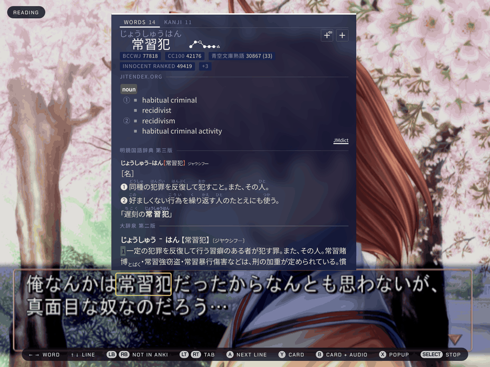
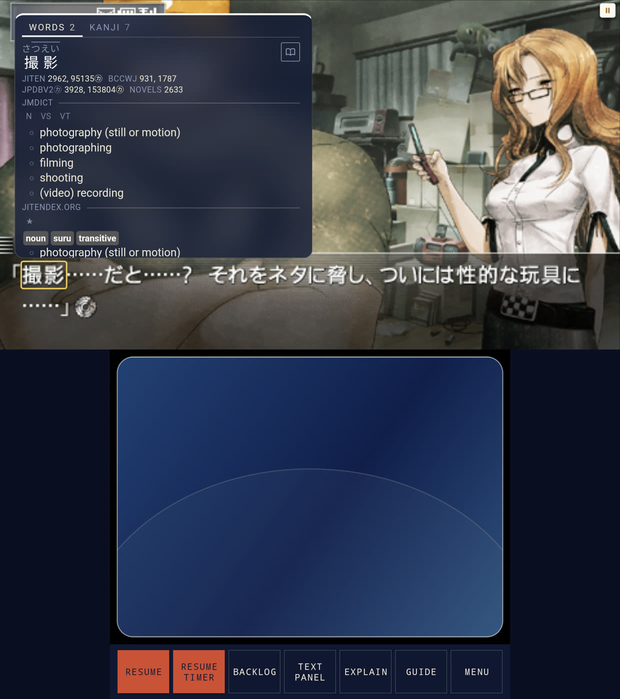

<h1 align="center">Furoshiki</h1>

<b>A Japanese game launcher for Windows, Linux, and Android with built-in emulators, memory-reading game scripts, dictionary popups, and Anki sentence mining.</b> 
Point at, tap, or step through exact in-game text with a controller, look up words on screen, and send cards straight to Anki.

<b>Latest releases:</b>
<a href="../../releases/download/v0.4.0.1/Furoshiki-0.4.0.1-android.apk">Android 0.4.0.1</a> ·
<a href="../../releases/download/v0.4.0.1/Furoshiki-0.4.0.1-windows.zip">Windows 0.4.0.1</a> ·
<a href="../../releases/download/v0.4.0.1/Furoshiki-0.4.0.1-linux.tar.gz">Linux 0.4.0.1</a> ·
<a href="../../releases/download/v0.4.0.1/Furoshiki-ocr-helper.zip">OCR helper (Windows)</a> ·
<a href="../../releases">all releases</a>

<a href="#memory-based-game-scripts">Game scripts</a> ·
<a href="#controller-first-experience">Controller reading</a> ·
<a href="#android-dual-screen-ocr-and-gamenative">Android &amp; dual-screen</a> ·
<a href="#reading-statistics-across-devices">Statistics</a> ·
<a href="docs/setup.md">Setup</a> ·
<a href="docs/supported-games.md">Supported games</a>

CLANNAD (PS2) on the desktop with the Kon popup at 80% opacity and blur, showing Jitendex, 明鏡, 大辞泉, frequency badges, and a pitch accent graph from Kanjium (all dictionaries are imported by the user).

## Memory-based game scripts

Furoshiki reads exact Japanese text and character positions straight from emulator memory using lightweight Lua **game scripts** ([sommepo/furoshiki-scripts](https://github.com/sommepo/furoshiki-scripts)). Seven emulator cores on Android (PlayStation, PS2, PSP, Dreamcast, 3DS, PS Vita, DS) and six on Windows and Linux are built into one app alongside local Yomitan dictionaries, VNDB character name cards, and one-press Anki sentence mining (word, sentence, screenshot, and line audio).

- **Exact text, no OCR errors:** Scripts read dialogue, speakers, furigana, and choices straight from RAM, placing interactive hitboxes over every character on screen.
- **Character name cards:** Supported titles include [VNDB](https://vndb.org)-backed character dictionaries prioritized ahead of general dictionaries.
- **Install inside the app:** Download and update scripts directly from **Settings › Game scripts**, or add new games by pull request with a coding agent.

A character name card on the <i>Names</i> tab in CLANNAD (PS2) on the desktop.

Settings › Game scripts on the desktop in the Kon theme.

See [Consoles and supported games](docs/supported-games.md) for the full list of supported titles, and [Adding a game](docs/adding-a-game.md) to add your own.

## Controller-first experience

Furoshiki is built to be used from a sofa or handheld with just a controller. Library browsing, statistics, settings, in-game menus, dictionary popups, and Anki card creation all work without a keyboard or mouse (mouse and keyboard work everywhere too).

Browsing the library shelf on the desktop in the Nocturne theme.

On the desktop, tap `Select` in-game to drop a cursor onto the first word in the current line that isn't in Anki yet. Step word by word with the D-pad, jump between unknown words with `LB`/`RB`, switch tabs (*Words*, *Grammar*, *Kanji*, *Names*) with `LT`/`RT`, send a card with `Y`/`B`, and advance dialogue with `A`.

Pointer-free controller reading on the desktop in CLANNAD (PS2): stepping word by word with the D-pad and advancing dialogue with <code>A</code>.

Stepping through 常, 習, and 犯 on the <i>Kanji</i> tab with the D-pad (using imported kanji dictionaries including KANJIDIC).

See [Reading, popups, and controller controls](docs/reading.md) for the full button map, keyboard shortcuts, and customization options.

## Android dual-screen, OCR, and GameNative

On Android, Furoshiki supports touch, controllers, and dual-screen handhelds such as the AYN Thor. The top display runs your library and game while the lower display shows game details, acts as a trackpad or lower-screen text panel in-game, and holds thumb controls for menus, statistics, and settings.

Library on the AYN Thor: games on the top display, cover, stats, and last line on the lower display (a checkmark marks games with a script).

Looking up 撮影 over STEINS;GATE (PSP) on the AYN Thor using the lower display as a trackpad, with <code>L1</code>/<code>R1</code> switching tabs.

For games without a script, **on-device OCR** (`meikiocr`, plus optional Google Lens) works out of the box on Android with no extra download. Furoshiki also integrates with [GameNative](https://github.com/utkarshdalal/GameNative) (and any other Android app) so you can launch Windows/Steam games on Android and read them with screen-capture OCR.

On-device OCR (Persona 4) and GameNative PC games on the AYN Thor (glasses mark titles with OCR configured).

See [Android, dual-screen, OCR, and GameNative](docs/android.md) for text panel mode, GameNative setup, and Android controls.

## Reading statistics across devices

The **Statistics** tab tracks your reading history across every title: daily, weekly, monthly, and yearly character goals (set with an inline soroban abacus), reading streaks, pace, a milestone ruler, a 52-week daily dot heatmap, and a per-period breakdown across *Week*, *Month*, *Year*, and *All time*.

Statistics are stored as per-device JSON files (`<device-id>.json`, plus `goals.json`) in a folder you can point at [Syncthing](https://syncthing.net/), a network share, or a cloud folder under **Settings › Sync & About › Statistics folder**. Because each device writes only its own file and reads the others, your Windows, Linux, and Android reading totals combine cleanly with no merge conflicts.

The Statistics tab on the desktop in the Nocturne theme (sample reading history).

Setting a character goal on the inline soroban abacus on the desktop.

Statistics on the AYN Thor with period and goal controls on the lower display.

## Documentation

| Guide | What it covers |
| --- | --- |
| [Setup and installation](docs/setup.md) | Downloads, dependencies, Windows/Linux/Android setup, BIOS folders, dictionary import, and Syncthing statistics sharing |
| [Consoles and supported games](docs/supported-games.md) | Built-in emulator cores and the full list of scripted games by console |
| [Reading, popups, and controller controls](docs/reading.md) | Dictionary lookups, VNDB character names, Anki cards, backlog, keyboard shortcuts, and full controller reading bindings |
| [Desktop features, OCR, themes, and settings](docs/desktop.md) | Windows PC game hooks, OCR helper (`meikiocr`, OneOCR, Chrome Screen AI, Google Lens), library themes, CRT filter, and Settings |
| [Android, dual-screen, OCR, and GameNative](docs/android.md) | Touch/controller play, AYN Thor trackpad & text panel modes, on-device OCR, and GameNative integration |
| [Adding a game](docs/adding-a-game.md) | Writing and verifying a new game script with a coding agent via `sommepo/furoshiki-scripts` |
| [Building from source](docs/building.md) | Repository layout, submodules, and Linux/Windows/Android build scripts |

## Help and licence

Report bugs or ask questions in [Issues](../../issues). Please do not report Furoshiki issues to upstream emulator projects. Furoshiki is not affiliated with them, or with Sony, Sega, or Nintendo.

Furoshiki and its cores are free software under the [GNU General Public License, version 3](COPYING) (also included in `home/`, `cores/`, and `shared/`). Each bundled emulator retains its own licence and notices in its folder; see [NOTICES.md](NOTICES.md) for full attributions, [titles/LICENSE](titles/LICENSE) for VNDB character name data (ODbL), and each script's header for [0xDC00's Agent](https://github.com/0xDC00/scripts) and [LunaHook](https://github.com/HIllya51/LunaTranslator) credits.
